# Fit Launcher

Fit Launcher is a 🚀 **blazingly fast** 🚀 (sorry it's made in rust, I have to write that) game launcher designed specifically for cracked games from FitGirl Repack. Built with Rust, Tauri, and SolidJS, this launcher delivers the best performance and a sleek, modern design. 

## Features
- **Lightning Fast**: Powered by Rust and Tauri for better speed and efficiency.
- **Easy to Use**: Simple setup and easy to run, just execute the launcher and you're good to go!
- **Quick Download**: Using **aria2c** for torrenting and DDL for optimal speed.

## Getting Started

### Images of the launcher


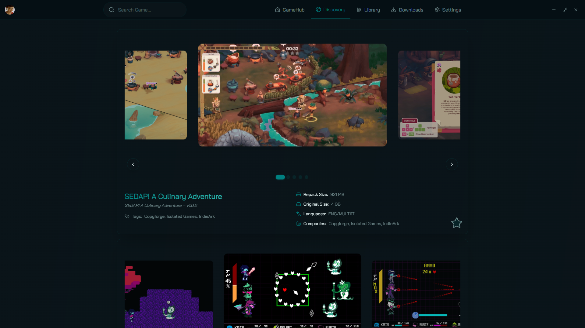
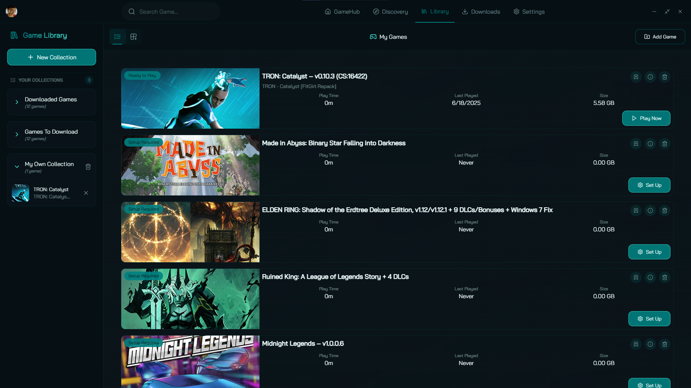
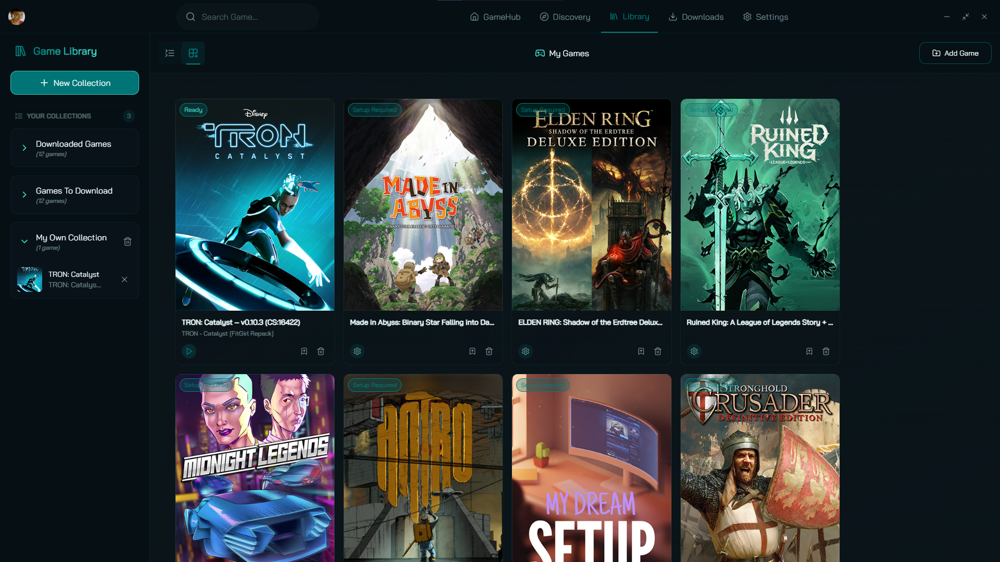
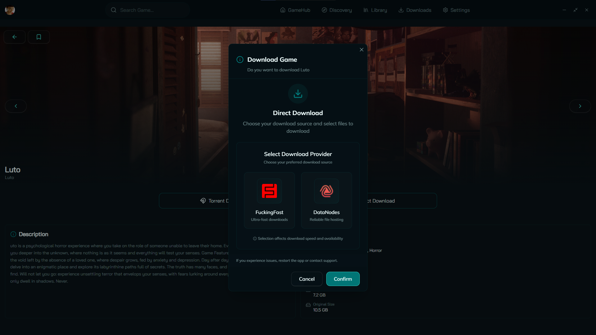
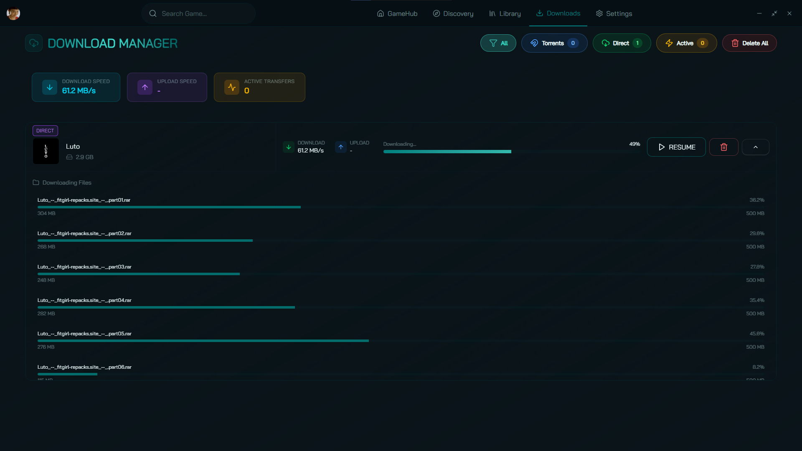
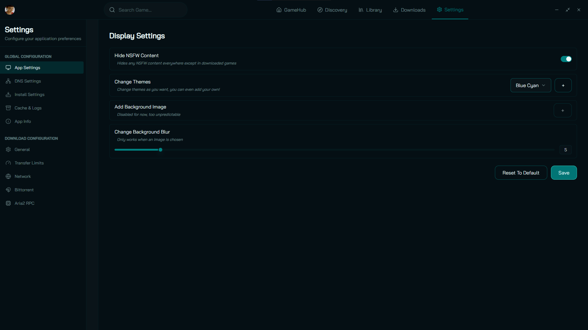
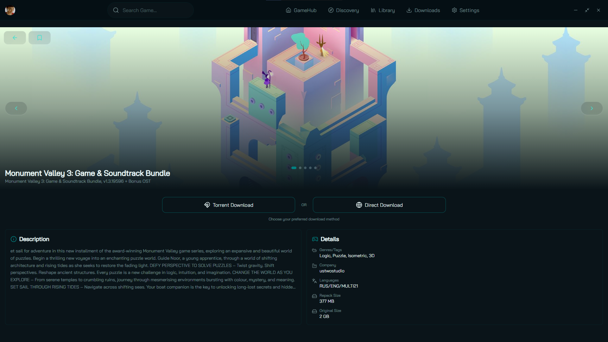

## Installation Guide

### Standard Mode

1. **Visit the Release Page**  
   Go to the [release page here](https://github.com/CarrotRub/Fit-Launcher/releases/latest).

2. **Download the Executable**  
   Scroll down until you find the executable, which will look like this `Fit.Launcher_3.X.X_x64_en-US.msi`

3. **Run it !**
   Once downloaded, simply execute the setup and install it inside
   `C:/Program Files/` then run the executable :) !

### Development Mode

If you want to run the launcher in development mode, follow these steps:

1. Ensure you have any **C++ Compiler**, **Rust**, and **Cargo** installed on your system.
2. Ensure you have these extensions on VSCode **C/C++ Microsoft** or **CodeLLDB** and **rust-analyzer**.
3. Clone this repository.
4. Run the dev command:

```bash
npm install
npm run tauri dev
```

### Building from Source on Windows

If you'd like to build Fit Launcher yourself, follow these steps:

1. Ensure you have any **C++ Compiler**, **Rust**, and **Cargo** installed on your system.
2. Ensure you have these extensions on VSCode **C/C++ Microsoft** or **CodeLLDB** and **rust-analyzer**.
3. Clone this repository.
4. Download and extract [aria2c.exe](https://github.com/mokurin000/aria2c-windows-hide-console/releases/) to `src-tauri/binaries/aria2c-x86_64-pc-windows-msvc.exe`.
5. Run this to build the binary:
```pwsh
cd src-tauri; cargo build --release -p fit-launcher-automation 2>&1 | Select-Object -Last 5; Copy-Item -Force "target\release\FitLauncherService.exe" "binaries\FitLauncherService-x86_64-pc-windows-msvc.exe"
```
6. Run the build command:

```bash
npm run tauri build
```

### Building on Linux

This project provides a unified setup script for Debian/Ubuntu and Fedora.

---

#### **Ubuntu / Debian / Fedora / Arch**

If you're on a Debian-based distro (Ubuntu, Pop!\_OS, Linux Mint, etc...), Fedora or Arch-based:

```bash
chmod +x install_deps.sh
./install_deps.sh
npm run tauri dev
```

This works for both fish and bash !

#### Manual setup

[tauri documentation]: https://v2.tauri.app/start/prerequisites/#linux

You could go to [tauri documentation] for tauri dependencies,

Then install rustup:

```bash
# For general distributions
curl --proto '=https' --tlsv1.2 -sSf https://sh.rustup.rs | sh
```

You may also need llvm-libs and lld for rustc.

Optionally setup fast node manager:

```bash
curl -fsSL https://fnm.vercel.app/install | bash
export PATH="$HOME/.local/share/fnm:$HOME/.fnm:$PATH"
eval "$(fnm env)"
fnm install --lts
fnm default --lts
```

Install node.js dependencies:

```bash
npm install
```

Build the project:

```bash
npm run tauri dev # development mode
```

## Create your own themes !
Now you can even customize the launcher to your liking, you can go check the tutorial on how to create a theme in doc/theme_creation.md

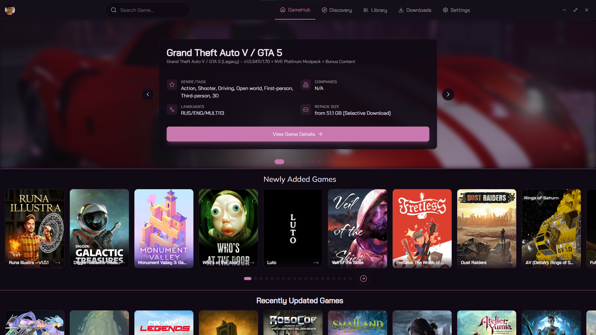
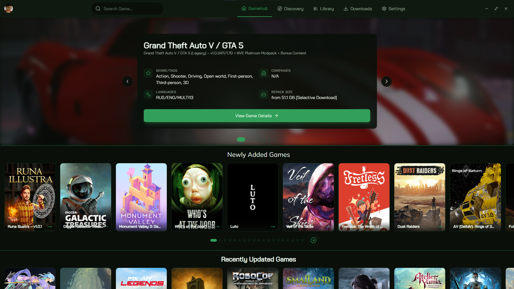
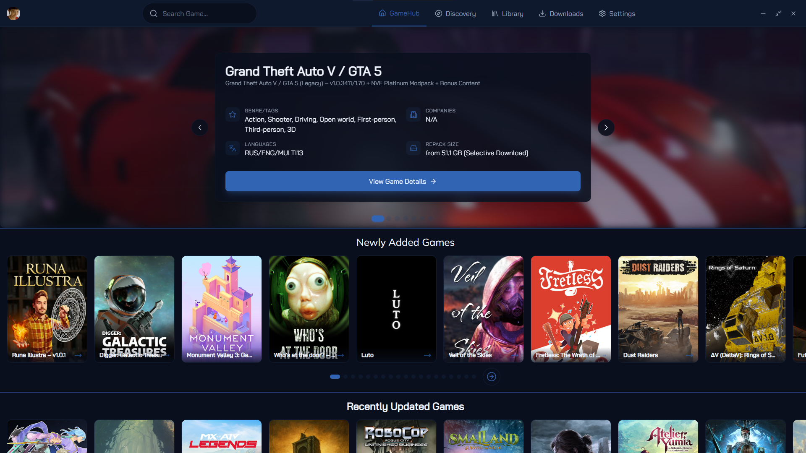
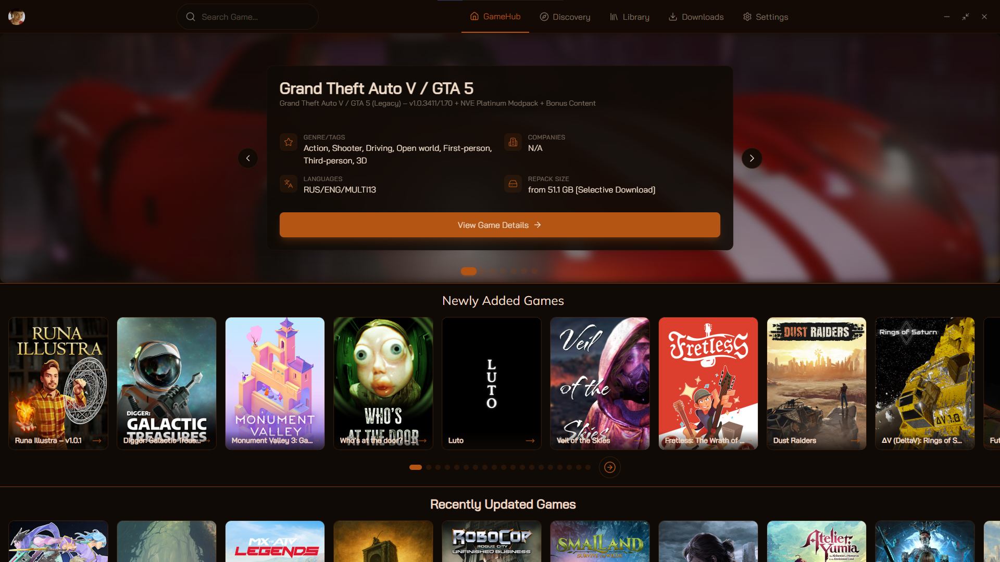
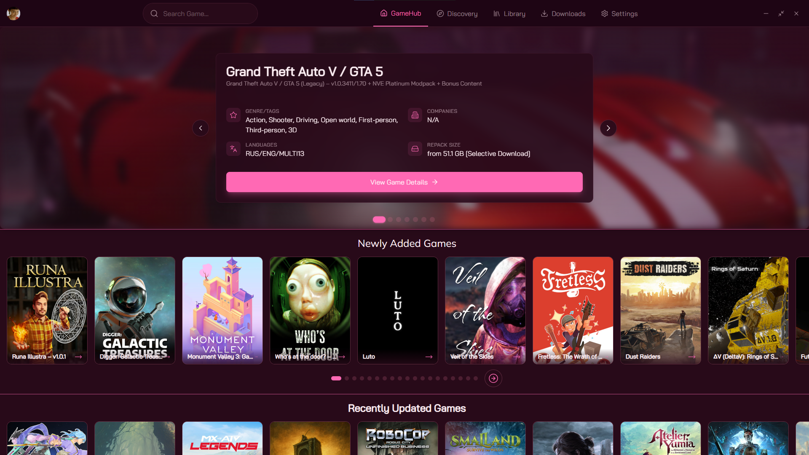

*The last one is a special theme, come on Discord to get it*

Here are a few of the default themes !
You can then create as much as you want.
Good luck !!

## Join Our Community 

Got questions or want to hang out with our users? Join us on Discord! Big thanks to **Kürst** for moderating our Discord server, to **mokurin** for helping me tremendously with the many and most issues in the backend and to **SimplyStoned** for maintaining the old launcher while I was developing this one.

[Join the Discord](https://discord.gg/cXaBWdcUSF)

## Credits

- **CarrotRub** - Me, Developer of this app (Design now too) :3.
- **mokurin000** - Main Contributor.
- **Kürst** - Discord Moderator and Technical and Visual Co-Contributor
- **Vintage_Soldier** - First App Design (Old design).
- **SimplyStoned** - Maintenance of the Old Launcher and Contributor.

---

Enjoy your games with Fit Launcher!

## TODO List 

- **Better Cross-Platform Compatibility**: Improve compatibility across different operating systems.
- **Filtering by Genres and Sizes**: Implement filters to sort games by genres and file sizes.
- **Control CPU Usage**: Allow the user to limit the CPU usage of the setup.
