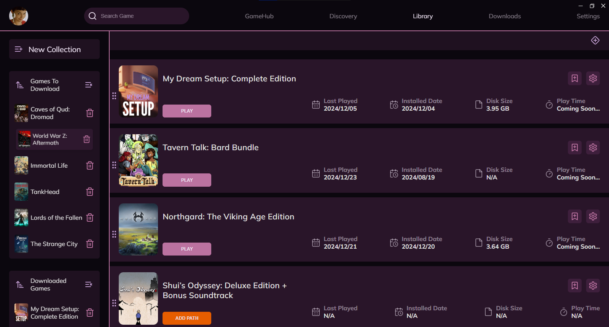
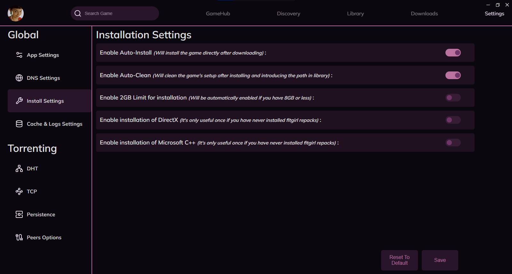
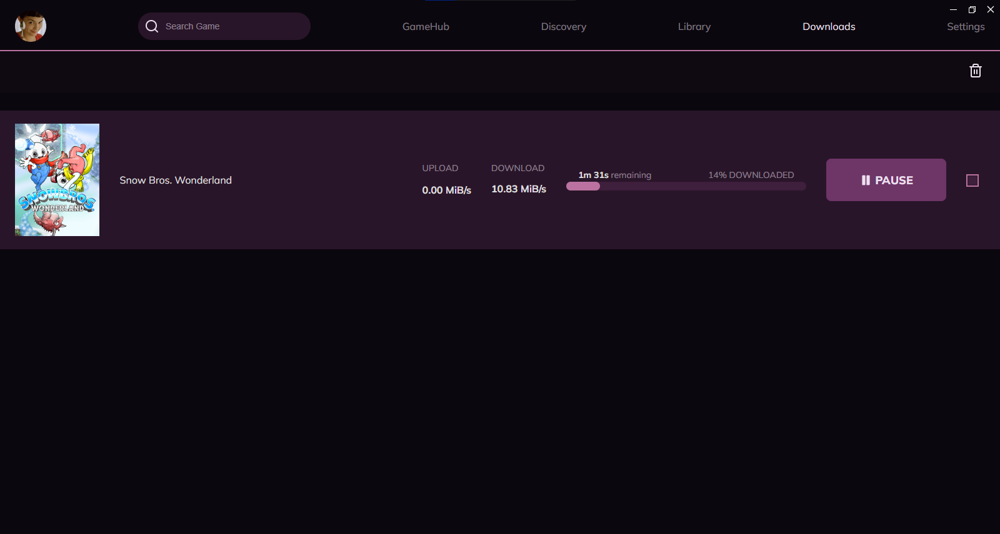

# 🎮 Fit Launcher

Fit Launcher is a 🚀 **blazingly fast** 🚀 game launcher designed specifically for cracked games from FitGirl Repack. Built with Rust, Tauri, and SolidJS, this launcher delivers top-notch performance and a sleek, modern design. 

## Features
- ⚡ **Lightning Fast**: Powered by Rust and Tauri for better speed and efficiency.
- 🎨 **Sleek Design**: Thanks to the creative design by Vintage_Soldier.
- 🛠️ **Easy to Use**: Simple setup and easy to run—just execute the launcher and you're good to go!
- 🌌 **Quick Download**: Using **librqbit** for torrenting for optimal speed.

## Getting Started

### Images of the launcher






## Installation Guide

### Standard Mode

1. **Visit the Release Page**  
   Go to the [release page here](https://github.com/CarrotRub/Fit-Launcher/releases/latest).

2. **Download the Executable**  
   Scroll down until you find the executable, which will look like this `Fit.Launcher_2.X.X_x64_en-US.msi`

3. **Run it !**
   Once downloaded, simply execute the setup and install it inside
   `C:/Program Files/` then run the executable 😃 !

### Development Mode

If you want to run the launcher in development mode, follow these steps:

1. Ensure you have any **C++ Compiler**, **Rust**, and **Cargo** installed on your system.
2. Ensure you have these extensions on VSCode **C/C++ Microsoft** or **CodeLLDB** and **rust-analyzer**.
3. Clone this repository.
4. Run the dev command:

```bash
npm install
npm run tauri dev
```

### Building from Source

If you'd like to build Fit Launcher yourself, follow these steps:

1. Ensure you have any **C++ Compiler**, **Rust**, and **Cargo** installed on your system.
2. Ensure you have these extensions on VSCode **C/C++ Microsoft** or **CodeLLDB** and **rust-analyzer**.
3. Clone this repository.
4. Run the build command:

```bash
npm run tauri build
```

## Create your own themes !
Now you can even customize the launcher to your liking, you can go check the tutorial on how to create a theme in doc/theme_creation.md


Here are a few of the default themes !
You can then create as much as you want.
Good luck 🎉

## Join Our Community 🎉

Got questions or want to hang out with our users? Join us on Discord! Big thanks to **Kürst** for moderating our Discord server, to **Vintage_Soldier** for the amazing app design, and to **SimplyStoned** for maintaining the old launcher while I was developing this one.

[Join the Discord](https://discord.gg/cXaBWdcUSF)

## Credits

- **CarrotRub** - Me, Developer of this app :3.
- **Kürst** - Discord Moderator and Technical and Visual Co-Contributor
- **Vintage_Soldier** - App Design
- **SimplyStoned** - Maintenance of the Old Launcher and Contributor.
- **mokurin000** - Contributor.

---

Enjoy your games with Fit Launcher! 🎮🚀

## TODO List 📝

- 🖥️ **Better Cross-Platform Compatibility**: Improve compatibility across different operating systems.
- 🌄 **Quicker Image Loading**: Optimize the speed at which images are retrieved and displayed.
- 🎮 **Filtering by Genres and Sizes**: Implement filters to sort games by genres and file sizes.
- 📟 **Control CPU Usage**: Allow the user to limit the CPU usage of the setup.
